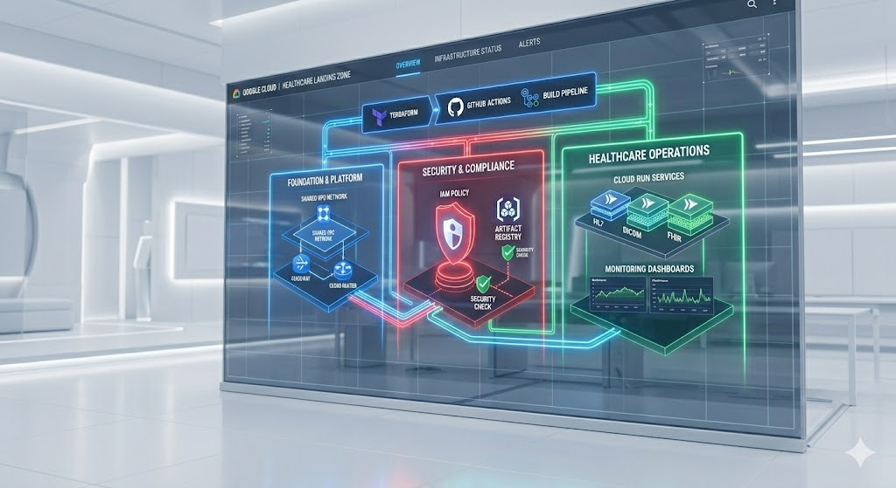
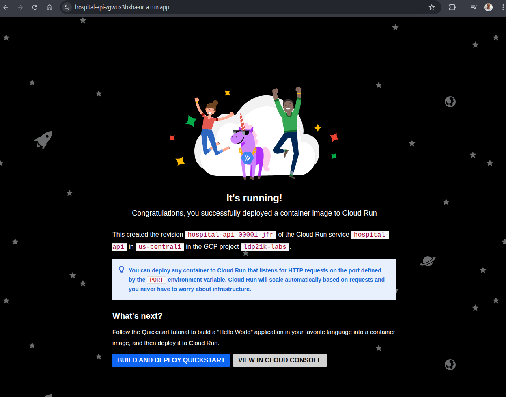

<div align="center">
  

  <h1>🏥 GCP Enterprise Landing Zone (Hospital Infrastructure)</h1>

  <p><i>A production-grade, multi-layer Landing Zone for healthcare workloads, following the Hub-and-Spoke networking model and Zero-Trust security.</i></p>

  <!-- Badges -->
  
  
  
  
</div>

<br>

## 🎯 The Mission

The goal of this project was to architect a high-security, compliant, and automated environment for a hospital application. It implements a **modular Infrastructure as Code (IaC)** strategy to isolate blast radiuses and ensure that networking, security, and application layers are managed independently while operating in perfect harmony.

This project simulates, in a **lean and realistic way**, the infrastructure design of a medium-sized hospital environment with approximately **100 employees** distributed across **3 independent teams**:

* 🏥 **Healthcare Operations Team**
* 🔐 **Security & Compliance Team**
* 💻 **Platform & Infrastructure Team**

The architecture was designed following the **Principle of Least Privilege (PoLP)**, ensuring that every user, service, and workload only has access to the exact permissions required to perform its function.

To improve resilience and reduce operational risk, the environment was built with **isolated environments and segmented responsibilities**, including:

* Separate networking and security domains
* Environment isolation between workloads
* Controlled access policies
* Modular Terraform components
* Independent state management
* Blast radius reduction strategies
* Automated provisioning and governance

The main objective was to demonstrate how modern cloud-native practices can be applied to healthcare environments where **security, compliance, scalability, and operational reliability** are critical requirements.

---

## 🏗️ Architecture & Governance

  


The infrastructure is divided into 4 specialized layers, ensuring a clean **Separation of Duties (SoD)**:

- **🌐 Network (The Hub):** Dedicated VPC with custom subnets, Cloud Router, and **Cloud NAT** for secure outbound-only internet access.
- **🔐 Security (The Vault):** Private **Artifact Registry** for Docker images and granular IAM roles using the Principle of Least Privilege.
- **🚀 Workloads (The App):** Serverless **Cloud Run v2** instances connected to the VPC via Serverless VPC Access connectors.
- **📊 Observability (The Eyes):** Automated Uptime Checks and Cloud Monitoring Dashboards for real-time health tracking.

---

## 🤖 CI/CD Orchestration (The Pipeline)

Our deployment follows a strictly **sequential workflow** to prevent state-locking and ensure data integrity:

1. **Foundation First:** Provisions the VPC and Networking.
2. **Security Sync:** Configures IAM and Container Repositories.
3. **App Deployment:** Deploys the Hospital API only after the network is stable.
4. **Ops Activation:** Enables monitoring once the service is live.

---

## 📸 Mission Accomplished (The Proof)

### 1. Secure Application Access
The Hospital API is running on a private network, accessible via an authenticated endpoint.


### 2. Automated Sequential Pipeline
Successful deployment of all 4 layers in the correct order via GitHub Actions.


### 3. Monitoring & Resilience
Real-time dashboard tracking the Hospital API health and uptime.


---

## 🛠️ Operational Commands

### **Setup the Hospital Infrastructure**
```bash
chmod +x scripts/setup.sh
./scripts/setup.sh